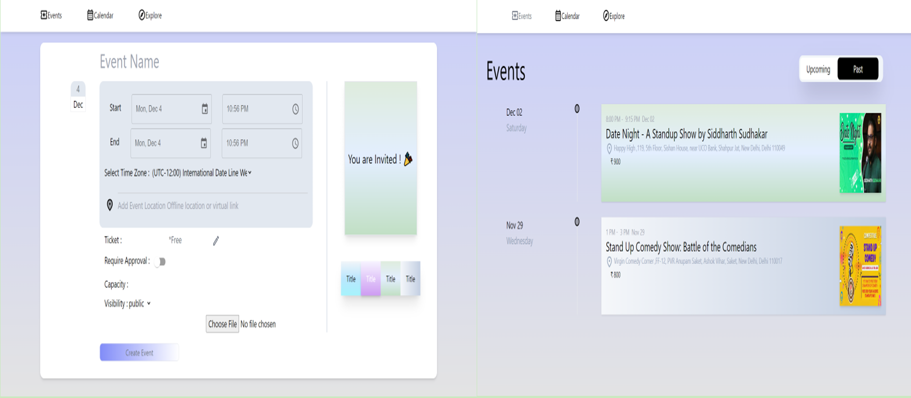

Eventify - React Event Web App
Welcome to Eventify, your go-to dynamic event web application built with React. Discover, create, and engage with a diverse array of events seamlessly. Whether you're hosting a gathering or seeking exciting events to attend, Eventify has you covered.

Key Features
Create Events: Effortlessly customize your events by providing essential details such as date, time, location, and a captivating event description.

Browse Past and Future Events: Explore a curated list featuring both past memories and upcoming adventures. Plan your schedule with ease.

User-Friendly Interface: A sleek and intuitive interface ensures a seamless experience for event creation and discovery, catering to users of all levels.

Responsive Design: Access Eventify effortlessly on various devices, guaranteeing a consistent and enjoyable user experience, whether you're on a desktop, tablet, or mobile device.

How to Use
Create an Event:
Click on the "Create Event" button.
Fill in the required details and customize your event.
Hit "Submit" to share your event with the vibrant Eventify community.
Discover Events:
Visit the event page to explore a curated list of both past and upcoming events.
Get Involved:
Join events that pique your interest and connect with like-minded individuals.
Share your experiences and create lasting memories by actively participating in various events.
Eventify simplifies the event management process, fostering a vibrant community of event creators and enthusiasts. Join us in shaping and sharing unforgettable experiences!

### Installation

1. Clone the repository:

    ```bash
    git clone https://github.com/preetikumari560/event.git
    ```

2. Navigate to the project directory:

    ```bash
    cd your-project
    ```

3. Install the Node modules:

    ```bash
    npm install
    ```


### Running the Project

Use the following command to start the project:

```bash
npm start
```

